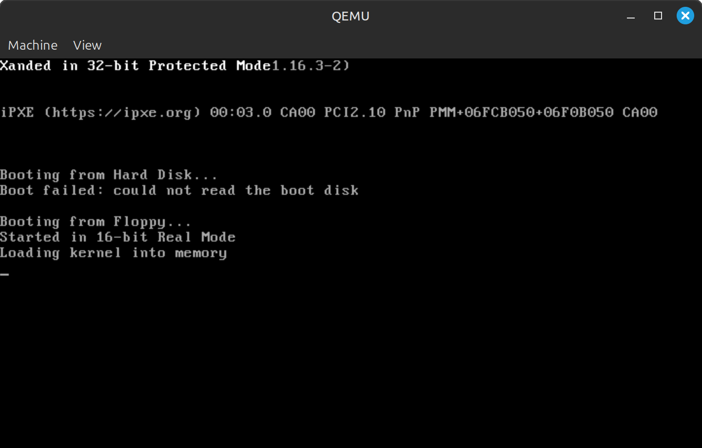

# Basic Operating System
## A Basic x86 Operating System


*(Optional: Replace this line with a relative path to a screenshot of your OS booting, e.g., `docs/screenshot.png`)*

This repository contains the source code for a minimal, "from-scratch" x86 operating system kernel. This was developed as the final project for the Operating Systems class at Universidad Autónoma de Guadalajara.

The primary goal of this project was not to create a full-featured consumer OS, but to demonstrate a deep understanding of low-level system architecture. It features a custom bootloader, 32-bit Protected Mode switching, and a monolithic kernel written in C.

## 🏫 Course Information

* **Institution:** `Universidad Autónoma de Guadalajara`
* **Course:** `Sistemas Operativos`
* **Professor:** `Agustín Villarreal`
* **Project:** `Final Project`

## 🚀 Features

This minimal OS currently implements the following low-level features:

* **Custom Bootloader:** Written in Assembly (NASM) to load the kernel from disk.
* **32-bit Protected Mode:** Transitions from 16-bit Real Mode to 32-bit Protected Mode (GDT configuration).
* **C Kernel:** High-level kernel logic compiled with a custom cross-compiler.
* **VGA Text Mode:** Custom drivers to print strings and hex values directly to video memory (`0xb8000`).
* **Cross-Compilation Toolchain:** Includes scripts to build a dedicated GCC/Binutils toolchain for the `i386-elf` architecture.
* **Architecture:** Monolithic Kernel design.

## 📂 Project Structure

* `boot/`: Assembly source code for the bootloader and GDT configuration.
* `kernel/`: C source code for the kernel and hardware drivers.
* `scripts/`: Automation scripts for environment setup.
* `Makefile`: Build automation for compiling and linking the OS image.

## 🛠 How to Build and Run

This project requires a specific cross-compiler toolchain because using your system's default C compiler (Linux/GCC) will cause linking errors for the OS kernel.

### 1. Prerequisites

You need a Linux environment (Ubuntu/Debian/Mint recommended).

**Step A: Install Dependencies**
Ensure you have the basics installed:
```bash
sudo apt update
sudo apt install build-essential bison flex libgmp3-dev libmpc-dev libmpfr-dev texinfo libncurses-dev nasm qemu-system-x86
```

**Step B: Install the Toolchain (Automated)**
We have provided a script to build the specific Cross-Compiler (GCC 4.9 + GDB) needed for this project.

1.  Run the setup script:
    ```bash
    ./scripts/install_toolchain.sh
    ```
2.  *Wait roughly 10-15 minutes for the compiler to build.*
3.  **Close your terminal and open a new one** to refresh your PATH.

### 2\. Build and Run

We use a `Makefile` to automate the compilation of Assembly and C files.

**To compile and run QEMU immediately:**

```bash
make run
```

**To clean up generated binary files:**

```bash
make clean
```

## 📚 Acknowledgements

This project was heavily inspired by the **"How to make an OS in C" tutorial** by Carlos Fenollosa (@cfenollosa). The structure and step-by-step guidance provided in that tutorial were the primary resource for this project.

  * **Original Tutorial Repository:** [github.com/cfenollosa/os-tutorial](https://github.com/cfenollosa/os-tutorial)

Our work involved adapting the tutorial code to modern Linux environments, creating automated build scripts, and refactoring the file structure for better organization.

-----

## 👥 Authors

  * **Lucas Castineiras** - `GitHub: Locas1000`
  * **Carlo Virgilio** - ` GitHub:  `
  * **Luis Mario Romano** - ` GitHub:  `
